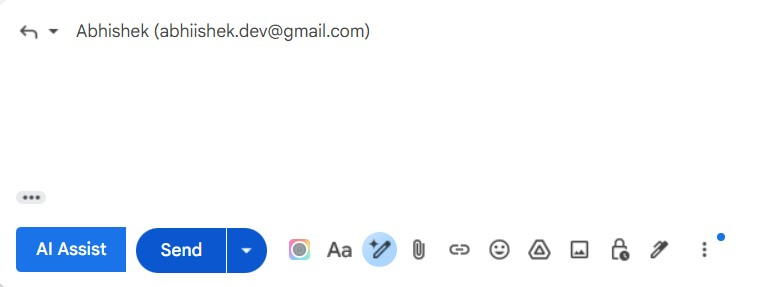

# 📧 AI Email Reply Assistant - Chrome Extension

> Email reply generation powered by Google's Gemini AI

A Chrome extension that integrates with Gmail to provide AI-powered email reply suggestions. Generate professional, contextual responses with a single click directly within your Gmail compose window.

## ✨ Features

- **One-Click AI Replies**: Generate email responses instantly
- **Gmail Integration**: Works seamlessly within Gmail's compose interface
- **Contextual Understanding**: Analyzes email content and recipient information
- **Personalized Responses**: Automatically addresses recipients by their name
- **Real-time Generation**: Instant reply suggestions powered by Gemini AI

## 🔗 Related Repositories

This extension is part of a complete email assistance solution:

- **[Backend API Repository](https://github.com/abhishek2316/Replyon)** - Spring Boot REST API handling Gemini AI integration
- **[Frontend Dashboard Repository](https://github.com/abhishek2316/email-ui)** - Management interface and analytics

## 🏗️ Architecture

```
┌─────────────────────┐
│  Chrome Extension   │
│   (Content Script)  │
└──────────┬──────────┘
           │
           │ HTTP Request
           │ (Email Context + Sender Info)
           ▼
┌─────────────────────┐
│   Backend API       │
│  (Spring Boot)      │
└──────────┬──────────┘
           │
           │ API Call
           │ (Prompt Engineering)
           ▼
┌─────────────────────┐
│   Gemini AI API     │
│  (Google AI)        │
└─────────────────────┘
```
## 🚀 Installation

1. Clone this repository
2. Open Chrome and go to `chrome://extensions/`
3. Enable "Developer mode"
4. Click "Load unpacked" and select the extension directory
5. Ensure backend API is running (see Backend Repository)


## 📖 How to Use

1. Open Gmail and navigate to any email thread
2. Click "Reply" to open the compose window
3. Look for the **"AI Assist"** button in the compose toolbar
4. Click to generate a personalized AI reply
5. Review and edit the response as needed
6. Send when ready

## 📸 Screenshots




## 📄 License

[Your License]

---

**Powered by Google Gemini AI** | Not affiliated with Google LLC or Gmail